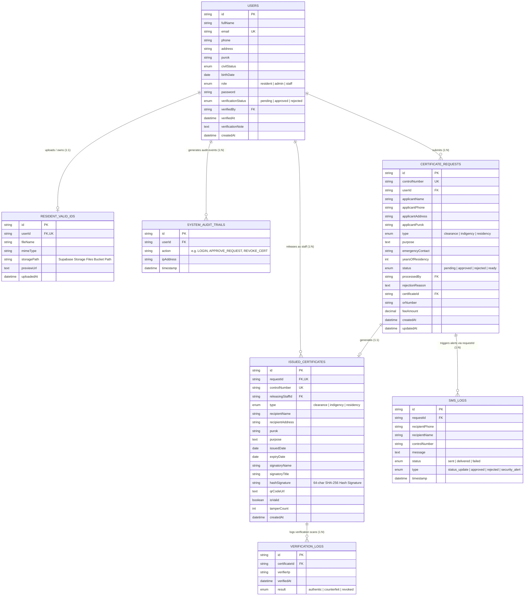
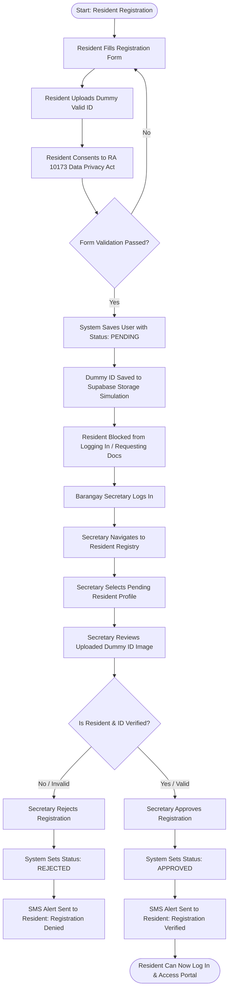
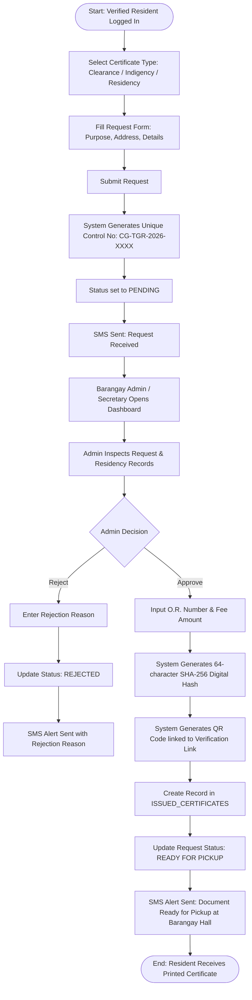
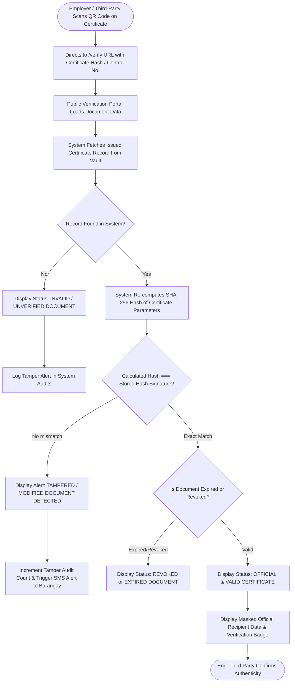
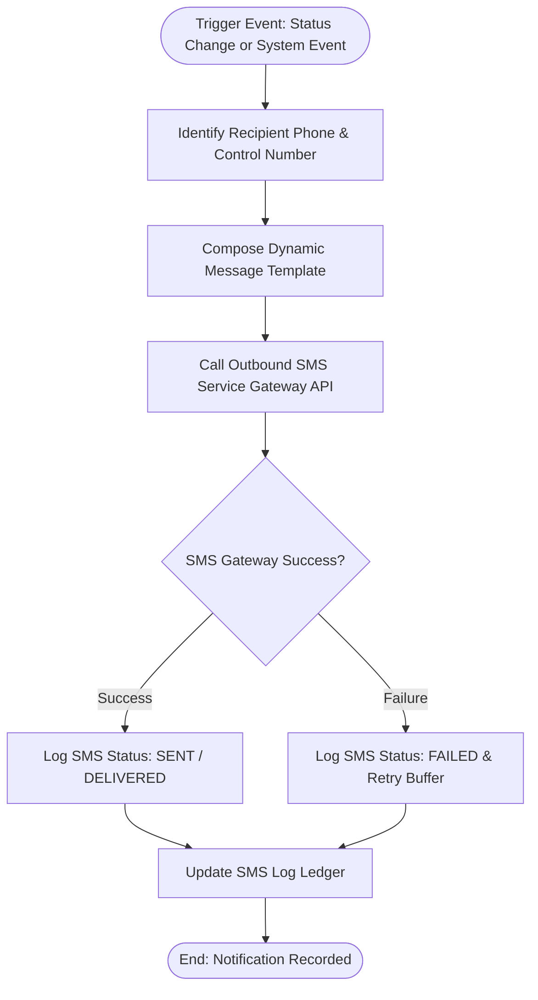

# CertiGuard System Architecture: Database ERD & Flowcharts

This document provides the complete Database Schema, Entity Relationship Diagram (ERD), Data Dictionary, and System Flowcharts for the **CertiGuard** (Barangay Taguranao Resident Census & Certificate Issuance System).

---

## 1. Entity Relationship Diagram (ERD)

The diagram below illustrates the entities, attributes, primary keys (PK), foreign keys (FK), and relationship cardinalities within the CertiGuard system.



### 1.1 dbdiagram.io Code (DBML - Ready to Copy & Paste)

You can copy and paste the code block below directly into [dbdiagram.io](https://dbdiagram.io/):

```dbml
Table users {
  id varchar(64) [pk]
  fullName varchar(150) [not null]
  email varchar(120) [unique, not null]
  phone varchar(20) [not null]
  address text [not null]
  purok varchar(50) [not null]
  civilStatus varchar(20) [not null]
  birthDate date [not null]
  role varchar(20) [not null]
  password varchar(255) [not null]
  verificationStatus varchar(20) [not null, default: 'pending']
  verifiedBy varchar(150)
  verifiedAt timestamptz
  verificationNote text
  createdAt timestamptz [not null]
}

Table resident_valid_ids {
  id varchar(64) [pk]
  userId varchar(64) [unique, not null]
  fileName varchar(255) [not null]
  mimeType varchar(50) [not null]
  storagePath varchar(255) [not null]
  previewUrl text [not null]
  uploadedAt timestamptz [not null]
}

Table system_audit_trails {
  id varchar(64) [pk]
  userId varchar(64) [not null]
  action varchar(150) [not null]
  ipAddress varchar(45) [not null]
  timestamp timestamptz [not null]
}

Table certificate_requests {
  id varchar(64) [pk]
  controlNumber varchar(50) [unique, not null]
  userId varchar(64) [not null]
  applicantName varchar(150) [not null]
  applicantPhone varchar(20) [not null]
  applicantAddress text [not null]
  applicantPurok varchar(50) [not null]
  type varchar(20) [not null]
  purpose text [not null]
  emergencyContact varchar(100)
  yearsOfResidency int [default: 1]
  status varchar(20) [not null, default: 'pending']
  processedBy varchar(150)
  rejectionReason text
  certificateId varchar(64)
  orNumber varchar(50)
  feeAmount decimal(10,2) [not null, default: 0.00]
  createdAt timestamptz [not null]
  updatedAt timestamptz [not null]
}

Table issued_certificates {
  id varchar(64) [pk]
  requestId varchar(64) [unique, not null]
  controlNumber varchar(50) [unique, not null]
  releasingStaffId varchar(64) [not null]
  type varchar(20) [not null]
  recipientName varchar(150) [not null]
  recipientAddress text [not null]
  purok varchar(50) [not null]
  purpose text [not null]
  issuedDate date [not null]
  expiryDate date [not null]
  signatoryName varchar(150) [not null, default: 'HON. ROBERTO D. DELA CRUZ']
  signatoryTitle varchar(100) [not null, default: 'Punong Barangay']
  hashSignature varchar(64) [unique, not null]
  qrCodeUrl text
  isValid boolean [not null, default: true]
  tamperCount int [not null, default: 0]
  createdAt timestamptz [not null]
}

Table sms_logs {
  id varchar(64) [pk]
  requestId varchar(64) [not null]
  recipientPhone varchar(20) [not null]
  recipientName varchar(150) [not null]
  controlNumber varchar(50)
  message text [not null]
  status varchar(20) [not null, default: 'sent']
  type varchar(30) [not null, default: 'status_update']
  timestamp timestamptz [not null]
}

Table verification_logs {
  id varchar(64) [pk]
  certificateId varchar(64) [not null]
  verifierIp varchar(45) [not null]
  verifiedAt timestamptz [not null]
  result varchar(30) [not null]
}

// Relationships (Foreign Keys)
Ref: resident_valid_ids.userId - users.id // 1:1
Ref: system_audit_trails.userId > users.id // 1:N
Ref: certificate_requests.userId > users.id // 1:N
Ref: issued_certificates.requestId - certificate_requests.id // 1:1
Ref: issued_certificates.releasingStaffId > users.id // 1:N
Ref: sms_logs.requestId > certificate_requests.id // 1:N
Ref: verification_logs.certificateId > issued_certificates.id // 1:N
```

---

## 2. Detailed Data Dictionary (Database Tables)

### Table 1: `users`
Stores user profile information for Residents, Barangay Admin (Captain), and Staff (Secretary).

| Column Name | Data Type | Constraints | Description |
| :--- | :--- | :--- | :--- |
| `id` | `VARCHAR(64)` | **PK**, NOT NULL | Unique user ID identifier (`user-admin-01`, `user-res-01`). |
| `fullName` | `VARCHAR(150)` | NOT NULL | Full legal name of the user. |
| `email` | `VARCHAR(120)` | **UNIQUE**, NOT NULL | Account email address used for signing in. |
| `phone` | `VARCHAR(20)` | NOT NULL | Contact mobile number for SMS notifications. |
| `address` | `TEXT` | NOT NULL | Detailed house/street residential address. |
| `purok` | `VARCHAR(50)` | NOT NULL | Assigned Barangay Purok/Zone (e.g. *Purok 1 Centro*). |
| `civilStatus` | `ENUM` | NOT NULL | `Single`, `Married`, `Widowed`, `Separated`. |
| `birthDate` | `DATE` | NOT NULL | Date of birth. |
| `role` | `ENUM` | NOT NULL | Account access role: `resident`, `admin`, `staff`. |
| `password` | `VARCHAR(255)` | NOT NULL | Hashed account credential password. |
| `verificationStatus`| `ENUM` | NOT NULL, DEFAULT `'pending'` | Resident residency verification status: `'pending'`, `'approved'`, `'rejected'`. |
| `verifiedBy` | `VARCHAR(150)` | NULLABLE | Name of the Secretary/Admin who verified the resident. |
| `verifiedAt` | `TIMESTAMP` | NULLABLE | Timestamp when the registration was approved/rejected. |
| `verificationNote` | `TEXT` | NULLABLE | Remarks/reasons provided during Secretary verification. |
| `createdAt` | `TIMESTAMP` | NOT NULL | Timestamp when account registration was initiated. |

---

### Table 2: `resident_valid_ids`
Stores metadata and file references for valid IDs uploaded during registration to verify resident residency.

| Column Name | Data Type | Constraints | Description |
| :--- | :--- | :--- | :--- |
| `id` | `VARCHAR(64)` | **PK**, NOT NULL | Unique record ID. |
| `userId` | `VARCHAR(64)` | **FK**, **UNIQUE**, NOT NULL | References `users.id` (1:1 relationship with resident). |
| `fileName` | `VARCHAR(255)` | NOT NULL | Original filename of the uploaded dummy ID image. |
| `mimeType` | `VARCHAR(50)` | NOT NULL | Image MIME type (`image/jpeg`, `image/png`, `image/webp`). |
| `storagePath` | `VARCHAR(255)` | NOT NULL | Supabase Storage bucket path (`resident-valid-ids/...`). |
| `previewUrl` | `LONGTEXT` | NOT NULL | Base64/SVG Data URL for quick image rendering & review. |
| `uploadedAt` | `TIMESTAMP` | NOT NULL | Upload timestamp. |

---

### Table 3: `certificate_requests`
Stores resident document applications and administrative processing state.

| Column Name | Data Type | Constraints | Description |
| :--- | :--- | :--- | :--- |
| `id` | `VARCHAR(64)` | **PK**, NOT NULL | Unique request ID (`req-2026-001`). |
| `controlNumber` | `VARCHAR(50)` | **UNIQUE**, NOT NULL | Public tracking control number (e.g. `CG-TGR-2026-0001`). |
| `userId` | `VARCHAR(64)` | **FK**, NOT NULL | References applicant `users.id`. |
| `applicantName` | `VARCHAR(150)` | NOT NULL | Snapshot of applicant full name at time of request. |
| `applicantPhone` | `VARCHAR(20)` | NOT NULL | Mobile number for status updates. |
| `applicantAddress`| `TEXT` | NOT NULL | Residence address string. |
| `applicantPurok` | `VARCHAR(50)` | NOT NULL | Purok location. |
| `type` | `ENUM` | NOT NULL | Type of requested certificate: `'clearance'`, `'indigency'`, `'residency'`. |
| `purpose` | `TEXT` | NOT NULL | Stated legal/employment purpose of the certificate. |
| `emergencyContact`| `VARCHAR(100)`| NULLABLE | Emergency contact info (if applicable). |
| `yearsOfResidency`| `INT` | NULLABLE | Declared duration of residency in years. |
| `status` | `ENUM` | NOT NULL, DEFAULT `'pending'` | Processing status: `'pending'`, `'approved'`, `'rejected'`, `'ready'`. |
| `processedBy` | `VARCHAR(150)` | NULLABLE | Administrative official who approved or rejected. |
| `rejectionReason` | `TEXT` | NULLABLE | Reason provided if request is denied. |
| `certificateId` | `VARCHAR(64)` | **FK**, NULLABLE | References generated `issued_certificates.id`. |
| `orNumber` | `VARCHAR(50)` | NULLABLE | Official Receipt (O.R.) tracking number. |
| `feeAmount` | `DECIMAL(10,2)`| NOT NULL, DEFAULT `0.00` | Processing fee charged for document issuance. |
| `createdAt` | `TIMESTAMP` | NOT NULL | Date request was submitted. |
| `updatedAt` | `TIMESTAMP` | NOT NULL | Date of last status update. |

---

### Table 4: `issued_certificates`
Stores official certificate records along with immutable 64-character SHA-256 cryptographic hashes for anti-tamper QR code verification.

| Column Name | Data Type | Constraints | Description |
| :--- | :--- | :--- | :--- |
| `id` | `VARCHAR(64)` | **PK**, NOT NULL | Unique issued certificate ID (`cert-2026-001`). |
| `requestId` | `VARCHAR(64)` | **FK**, **UNIQUE**, NOT NULL | References originating `certificate_requests.id`. |
| `controlNumber` | `VARCHAR(50)` | **UNIQUE**, NOT NULL | Document tracking control number (`CG-TGR-2026-0001`). |
| `releasingStaffId` | `VARCHAR(64)` | **FK**, NOT NULL | References `users.id` (Staff/Secretary who validated and released). |
| `type` | `ENUM` | NOT NULL | Certificate classification. |
| `recipientName` | `VARCHAR(150)` | NOT NULL | Official name printed on document. |
| `recipientAddress`| `TEXT` | NOT NULL | Official address printed on document. |
| `purok` | `VARCHAR(50)` | NOT NULL | Barangay Purok/Zone. |
| `purpose` | `TEXT` | NOT NULL | Certified purpose. |
| `issuedDate` | `DATE` | NOT NULL | Date of official issuance. |
| `expiryDate` | `DATE` | NOT NULL | Validity expiration date (e.g. 6 months/1 year). |
| `signatoryName` | `VARCHAR(150)` | NOT NULL | Name of issuing official (*Hon. Roberto D. Dela Cruz*). |
| `signatoryTitle` | `VARCHAR(100)` | NOT NULL | Title of official (*Punong Barangay*). |
| `hashSignature` | `VARCHAR(64)` | NOT NULL | **64-char SHA-256 cryptographic digital signature hash**. |
| `qrCodeUrl` | `LONGTEXT` | NOT NULL | Data URI or URL linking to verification portal (`/verify/:hash`). |
| `isValid` | `BOOLEAN` | NOT NULL, DEFAULT `TRUE` | Validity status flag (set to false if revoked). |
| `tamperCount` | `INT` | NOT NULL, DEFAULT `0` | Audit counter tracking invalid verification attempts. |
| `createdAt` | `TIMESTAMP` | NOT NULL | Timestamp of document creation. |

---

### Table 5: `sms_logs`
Stores outbound SMS notification history triggered by status changes, now connected to `certificate_requests.id`.

| Column Name | Data Type | Constraints | Description |
| :--- | :--- | :--- | :--- |
| `id` | `VARCHAR(64)` | **PK**, NOT NULL | Unique log identifier (`sms-171000000`). |
| `requestId` | `VARCHAR(64)` | **FK**, NOT NULL | Foreign key referencing `certificate_requests.id`. |
| `recipientPhone` | `VARCHAR(20)` | NOT NULL | Target mobile number. |
| `recipientName` | `VARCHAR(150)` | NOT NULL | Target recipient full name. |
| `controlNumber` | `VARCHAR(50)` | NOT NULL | Control number associated with the alert. |
| `message` | `TEXT` | NOT NULL | Full text content sent via SMS Gateway API. |
| `status` | `ENUM` | NOT NULL | Delivery status: `'sent'`, `'delivered'`, `'failed'`. |
| `type` | `ENUM` | NOT NULL | Classification: `'status_update'`, `'approved'`, `'rejected'`, `'security_alert'`. |
| `timestamp` | `TIMESTAMP` | NOT NULL | Time SMS was dispatched. |

---

### Table 6: `system_audit_trails`
Tracks administrative operations, authentication events, and certificate status changes for accountability.

| Column Name | Data Type | Constraints | Description |
| :--- | :--- | :--- | :--- |
| `id` | `VARCHAR(64)` | **PK**, NOT NULL | Unique audit log ID (`audit-171000000`). |
| `userId` | `VARCHAR(64)` | **FK**, NOT NULL | References `users.id` who performed the action. |
| `action` | `VARCHAR(150)` | NOT NULL | Description of action (e.g. `'LOGIN'`, `'APPROVE_REQUEST'`, `'REVOKE_CERT'`). |
| `ipAddress` | `VARCHAR(45)` | NOT NULL | Client IP address of the user. |
| `timestamp` | `TIMESTAMP` | NOT NULL | Timestamp when the action occurred. |

---

### Table 7: `verification_logs`
Records public verification scans, mobile camera accesses, and detection of forged/tampered QR codes.

| Column Name | Data Type | Constraints | Description |
| :--- | :--- | :--- | :--- |
| `id` | `VARCHAR(64)` | **PK**, NOT NULL | Unique verification attempt ID (`vlog-171000000`). |
| `certificateId` | `VARCHAR(64)` | **FK**, NOT NULL | References `issued_certificates.id` being verified. |
| `verifierIp` | `VARCHAR(45)` | NOT NULL | IP address of the scanning device or public verifier. |
| `verifiedAt` | `TIMESTAMP` | NOT NULL | Timestamp of scan/verification query. |
| `result` | `VARCHAR(30)` | NOT NULL | Outcome: `'authentic'`, `'counterfeit'`, `'revoked'`, `'expired'`. |

---

## 3. System Flowcharts

### Flowchart 1: Resident Registration & Secretary ID Verification Flow



---

### Flowchart 2: Certificate Request, Administrative Approval, & Issuance Flow



---

### Flowchart 3: Public QR Code & Cryptographic Verification Flow



---

### Flowchart 4: Automated Outbound SMS Gateway Flow



---

## 4. Key Architectural Highlights & Summary

1. **Relational Integrity:**
   - Every `certificate_request` belongs to 1 `user` (`userId` FK).
   - Every `issued_certificate` links 1:1 with a `certificate_request` (`requestId` & `controlNumber` FK).
   - `resident_valid_ids` links 1:1 with `users` (`userId` FK).
2. **Cryptographic Anti-Tamper Security:**
   - Hash field: `hashSignature` stores an immutable SHA-256 digest (`SHA-256(controlNumber + recipientName + type + purpose + issuedDate + secret)`).
   - Any external tampering of a printed or digital document breaks the hash match during public QR verification.
3. **Privacy Compliance (R.A. 10173):**
   - Dummy ID uploads are stored in an isolated storage bucket/table (`resident_valid_ids`), strictly accessible to authorized Barangay Officers, and excluded from public certificate documents.
